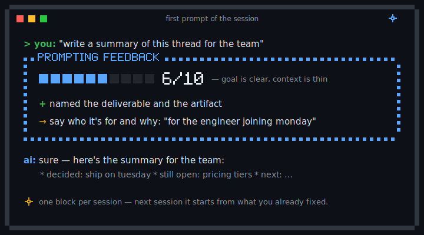

# Prompt Evaluator

> Paste one block into any AI's custom instructions. Every chat starts with quiet, specific feedback on how you prompt — and it gets sharper as it learns your patterns.

[](./LICENSE)
[](#quick-start--any-ai-60-seconds)
[](#the-personalized-setup)

A small, persistent prompting coach. It scores how you ask, names one thing to sharpen, and remembers your recurring patterns so the feedback gets *more targeted* over time. No app, no service, no telemetry — it's ~20 lines of instruction text.

Inspired by [Andrej Karpathy's observations](https://x.com/karpathy/status/2015883857489522876) on simple, durable AI behaviors — applied to the prompting layer itself: the part most people never get feedback on.

<p align="center">
  
</p>

---

## Quick start — any AI, 60 seconds

There are two ways to run the evaluator. This is the fast one: paste once, works anywhere, personalization rides on your AI's built-in memory. Serious about improving? There's also **[the personalized setup](#the-personalized-setup)** — a real memory file that learns *your* recurring prompt problems, so every session's feedback builds on the last.

The fast way: no install, no terminal, no plugin. You copy a block of text, paste it once, and you're done.

**1. Copy this block** (canonical copy lives in [PROMPT.md](./PROMPT.md)):

```
## Prompting Quality Feedback

Evaluate my prompts at two moments:
1. After my first prompt of every session — evaluate immediately, no permission needed.
2. At a natural milestone (a deliverable lands, the topic pivots) — ask me first.

Format:
> PROMPTING FEEDBACK
> X / 10 — one-line rationale
> What worked: one specific observation
> To sharpen: one concrete suggestion, with an example

After each evaluation, update a memory file called `user_prompting_profile.md`
with my recurring strengths and weak spots, so the feedback gets more targeted
every session instead of starting fresh.

Read `user_prompting_profile.md` at the start of every session so each new
evaluation builds on the last one.
```

**2. Paste it where your AI keeps always-on instructions:**

| Your AI | Where to paste |
|---|---|
| **ChatGPT** | Settings → Personalization → Custom Instructions |
| **Claude** (web / desktop) | Settings → Profile → response preferences |
| **Gemini** | Saved info — or a Gem's instructions |
| **Anything else** | Wherever it accepts custom or system instructions |

**3. Send your next message.** The first reply opens with your first score. That's the whole setup — and the block is the same for a developer or for someone who has never opened a terminal.

Want to feel the value before pasting? **[EXAMPLES.md](./EXAMPLES.md)** has five real prompts, the evaluator's feedback on each, and the sharpened version.

One honest caveat: `user_prompting_profile.md` is a real file only where the AI can write files (Claude Code / Cowork). In ChatGPT and Gemini the profile persists through the assistant's built-in memory — turn Memory on, or expect the compounding to be weaker. The per-session feedback block works everywhere either way. Closing that gap is exactly what the [personalized setup](#the-personalized-setup) is for.

---

## The Problem

What prompting feels like for most people:

> You've used AI for a year and never gotten feedback on how you ask. Your prompts plateau, but you don't know which ones.

> AI does exactly what you asked, even when you asked badly. So you never find out you asked badly.

> You repeat the same mistakes across chats: bury the question, skip the audience, forget the why. Nobody tells you.

> You read a "10 prompting tips" article. It doesn't stick, because the tips aren't about *your* prompts.

The evaluator closes the loop: feedback on the prompts you're already writing, from something that remembers what you already fixed — no course, no framework, no chasing prompt-engineering advice that changes every month. It scores the structure of your ask, not your grammar, so it works the same if English isn't your first language.

---

## How it works

Two triggers, never more. Trigger 1 fires after your first prompt of every session, no permission needed. Trigger 2 fires at natural milestones (a deliverable lands, the topic pivots) and asks first. Evaluating every message becomes a nag; evaluating only at session start misses the moments where reflection helps. Two triggers is enough signal at low noise. As the `/evaluate` command (personalized setup), there are no triggers — it runs only when you call it.

The format is always the same shape:

> **PROMPTING FEEDBACK**
> **6 / 10** — Goal is clear, context is thin.
> **What worked:** Named the audience (engineers) and the format (bullets).
> **To sharpen:** Add *why* it's needed. Try: *"for the weekly eng sync, they know the tech, so focus on business impact."*

One score, one thing that worked, one concrete thing to sharpen with an example. No theory.

The compounding comes from memory. After each evaluation the AI updates `user_prompting_profile.md`, and at the start of every session it reads that file first, so the next evaluation builds on the last instead of starting fresh. The leverage isn't the format; it's that the feedback remembers what you already fixed.

---

## The personalized setup

For the hardworkers. The fast path scores your prompts; this one makes the feedback *compound*. In Claude Code / Cowork, `user_prompting_profile.md` is a real file that grows with your patterns — the evaluator learns your specific prompt problems, stops repeating advice you already fixed, and gets more targeted every session. Two ways to run it:

**The `/evaluate` command (plugin).** On-demand scoring you trigger yourself, so nothing fires unasked. Install once:

```
/plugin marketplace add isabela-valonni/prompt-evaluator
/plugin install prompt-evaluator@prompt-evaluator
```

Then run `/prompt-evaluator:evaluate` after any prompt (Claude Code may also accept the short `/evaluate`). If the marketplace add hits an SSH error, use the HTTPS URL `https://github.com/isabela-valonni/prompt-evaluator.git`.

**Always-on via `CLAUDE.md`.** Append the clean block to your project's `CLAUDE.md` (run once, so the block isn't duplicated):

```bash
echo "" >> CLAUDE.md && curl -s https://raw.githubusercontent.com/isabela-valonni/prompt-evaluator/main/claude-md-block.md >> CLAUDE.md
```

One caution: don't stack auto-fire channels. If your custom instructions, a `CLAUDE.md`, or a global config already carries prompting-feedback instructions, adding another copy produces two feedback blocks per session. Pick one source.

---

## How to Know It's Working

A feedback block appears in the same format every time — on your first prompt each session, or right after you run the command. The observation is specific, not generic ("you named the audience but skipped the why" beats "add more context"). A `user_prompting_profile.md` file grows over sessions. The "to sharpen" line stops repeating itself as you internalize each fix. You start catching yourself before sending. If the block stops appearing, the evaluator has drifted out of memory — re-paste.

## Tradeoff

The evaluator adds a small block at the start of each session, even on a 30-second lookup. It also keeps state in `user_prompting_profile.md`. Best fit: you use AI several times a week for real work and feel your prompting has plateaued. Worst fit: occasional quick lookups, or "I just want answers, not coaching."

---

## Related

- **[EXAMPLES.md](./EXAMPLES.md)** — five prompts, scored, with the sharpened version.
- **[easy-ai-pm](https://github.com/isabela-valonni/easy-ai-pm)** — companion repo for Product Managers. The evaluator shapes *how you ask*; easy-ai-pm shapes *what the AI does* with it. They compose.

---

⭐ If this helped you write a sharper prompt, star the repo so others can find it.

Built for anyone who's prompted AI more than 100 times and never had someone read over their shoulder.
